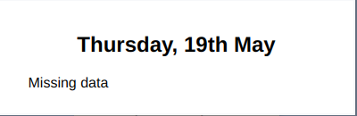

# About the project

**The Weather Forecast** is a simple web application to display 5-day wearher forecast for selected location.

[View demo](https://ws-weather-forecast.herokuapp.com/)

## Built with

<p>  <a href="https://reactjs.org/">React</a></p>
<p>  <a href="https://styled-components.com/">Styled components</a></p>
<p>  <a href="https://storybook.js.org/">Storybook</a> </p>
<p>  <a href="https://react.i18next.com/">react-i18next</a></p>
<p>  <a href="https://mui.com/">Material UI</a></p>
<p>  <a href="https://momentjs.com/docs/">Moment.js</a></p>
<p>  <a href="https://axios-http.com/">Axios</a></p>

## Used APIs

To get forecast data and cities locations the following APIs was used:

- https://openweathermap.org/api/one-call-api
- https://openweathermap.org/api/geocoding-api

You need to create an account on https://openweathermap.org/ to get your free api key.

# Demo

Demo version was deployed on Heroku, using CircleCI, and can be accesed **[here](https://ws-weather-forecast.herokuapp.com/)**.

# Getting started

To setup the project locally you need to follow these steps:

1. Create an account on https://openweathermap.org/ website to get your API key.

2. Install **node** (if you haven't installed it yet)

- Installation: https://nodejs.org/en/download/

3. Clone the repo

```bash
$ git clone https://github.com/wikk2207/Weather-Forecast.git
```

4. Install project dependencies in the project root directory

```bash
$ cd Weather-Foreast
$ npm install
```

5. Create `.env` file in the project root directory. You can find needed variables in `.env.example` file. Use there your API key from https://openweathermap.org/.

6. Start the app

```bash
$ npm start
```

# NPM scripts

- Run the appplication with `npm start`
- Run the storybook with `npm run storybook`
- Run tests with `npm test`

# Implementation details

This project is only a basic implementation, which I was able to do in such a short time, that was given for this task, so structure and styles may need some improvement.

## "Missing data"

Some explanation to "Missing data" on forecast details modal:



I used the forecast API which returns hourly forecast only for next 48 hours and I show the statisctis only if a selected day contains complete data set with hourly forecast (24 hours). It mean that in current implementation the statisctis are shown only for the next day.

# Possible improvements

- Add padding to the main page, because it looks bad on small devices
- Enlarge a text in an icon tooltip
- Use an API with more hourly forecast data :)
- Use some API to get cities instead of having them hardcoded
